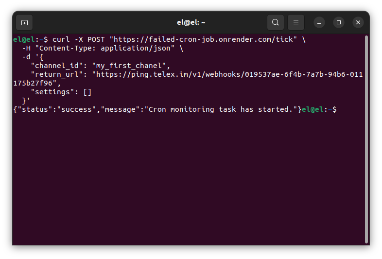
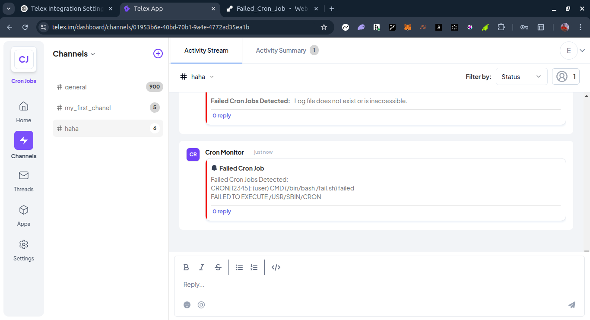

# Failed Cron Job Monitor

## Introduction

The Failed Cron Job Monitor is a monitoring and alerting tool that tracks failed cron jobs and integrates with the Telex platform. It checks for failed cron jobs by analyzing system logs and sends alerts to Telex after 5mintues if failures are detected.

## Setting Up

This is a FastAPI project and has its dependencies defined in the requirements.txt. This means you can use pip or any other package manager to install depdencies. For an easier install, use uv by following the steps below:

1. **Clone the git repository**
    ```bash
    git clone "https://github.com/edenis00/Failed_Cron_Job.git
    cd Failed_Cron_Job
    ```

2. **Virtual Environment**: Activate a virtual environment
    ```bash
    python3 -m venv venv
    source venv/bin/activate # for windows venv/Scripts/activate
    ```

3. **Run the application**: Start the application with the command:
    ```bash
    uvicorn main:app --reload
    ```


The server should now be running and accessible at `http://localhost:8000`.

## Integration JSON

The integration JSON file defined at the route /integration.json contains all the details needed for this integration to work on Telex. Since it is an interval-based integration that doesn't require external data, it only exposes a /tick_url endpoint. Telex will call this endpoint according to the cron interval defined in the settings.

```json
{
  "data": {
    "date": {
      "created_at": "2025-02-22",
      "updated_at": "2025-02-22"
    },
    "descriptions": {
      "app_name": "Failed Cron Job",
      "app_description": "Monitors failed cron job and sends alerts",
      "app_logo": "https://i.imgur.com/lZqvffp.png",
      "app_url": "https://failed-cron-job.onrender.com",
      "background_color": "#fff"
    },
    "is_active": false,
    "integration_type": "interval",
    "key_features": [
      " Monitors failed cron jobs",
      " Sends alerts to telex",
      " Configurable cron log path and monitoring interval"
    ],
    "integration_category": "Monitoring & Logging",
    "author": "Elijah Denis",
    "website": "https://failed-cron-job.onrender.com/",
    "settings": [
      {
        "label": "cron_log_path",
        "type": "dropdown",
        "description": "Path to the cron log file",
        "default": "/var/log/syslog",
        "required": true,
        "options": [
          "/var/log/syslog",
          "/var/log/cron.log",
          "/var/log/messages",
          "/var/log/auth.log"
        ]
      },
      {
        "label": "interval integration",
        "type": "text",
        "description": "Run in interval of 5 minutes",
        "default": "*/5 * * * *",
        "required": true
      },
    ],
    "target_url": "",
    "tick_url": "https://failed-cron-job.onrender.com/tick"
  }
}
```

## Request Format

The `/tick` endpoint accepts a `POST` request with the following JSON payload:

```json

{
  "channel_id": "test_channel",
  "return_url": "https://your_telex_webhook_url",
  "settings": [
    {
      "label": "cron_log_path",
      "type": "dropdown",
      "required": true,
      "default": "/var/log/syslog"
    },
  ]
}

```

### Explanation:

- `channel_id`: The ID of the Telex channel.
- `return_url`: The URL where the monitoring results will be sent.
- `settings`: An array of settings for the monitored sites. The settings are defined by the integration author and can only be used by the author. Telex only sends the settings whenever the /tick_url is called.


### Response:

- **202 Accepted**: The monitoring task has been accepted and is running in the background.

## Testing the Integration Locally

You can test the `/tick` enpoint locally using `curl`

```bash
curl -X POST "https://failed-cron-job.onrender.com/tick" \
  -H "Content-Type: application/json" \
  -d '{
    "channel_id": "my_first_chanel", 
    "return_url": "https://ping.telex.im/v1/webhooks/019537ae-6f4b-7a7b-94b6-011175b27f96", 
    "settings": []
  }'

```

Once the post request is sent


Check the channel for the result



## Expected Response

```bash
"status": "success",
"message": "Cron monitoring task has been completed."
```
